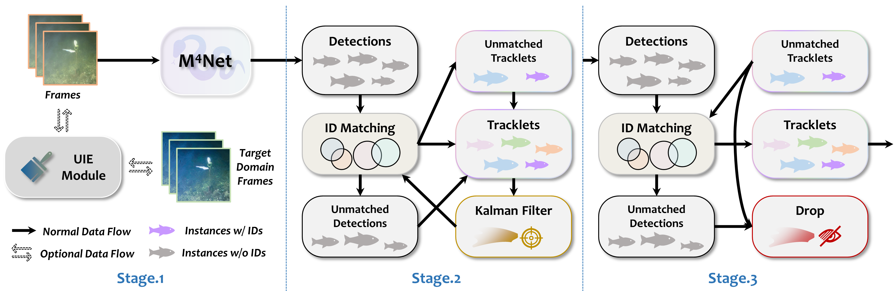

# M$^4$FT: Mamba, Migratory, Mobile and Multiple Fish Tracking

The official implementation of the paper：
>  [**M$^4$FT: Mamba, Migratory, Mobile and Multiple Fish Tracking**](##TODO:LINK##)  
>  Weiran Li, Yeqiang Liu, Wenxu Wang, Fukuan Wang, Zhenbo Li*
>  [**\[Paper\]**](##TODO:LINK##) [**\[Code\]**](https://github.com/vranlee/M-4-FT)

<div align="center">

</div>

<div align="center">

</div>


Contact: vranlee@cau.edu.cn or weiranli@u.nus.edu. Any questions or discussion are welcome!

-----

## Updates
+ [270225] We have released the public repo with related resources. The further reorganization and optimization will be done after the paper accepted.
+ [270225] Sadly be rejected by CVPR25. Keep it up, and almost there! haha
-----


## Abstract
Tracking is a core technique for analyzing fish social behaviors, such as schooling and predator avoidance. Compared to general vehicle or pedestrian tracking, fish tracking presents unique challenges, including flexible target deformation and low-light conditions. Additionally, lightweight and high-density deployment scenarios exacerbate issues like target loss and identity switching, making it a particularly challenging application. In this paper, we propose M $^4$ FT, a lightweight, online fish tracking baseline designed for low-light scenarios. Our method is based on the SORT tracking framework that operates without complex appearance features. The selective scan module is embedded in the proposed feature extraction network, termed M $^4$ Net, supporting global detection while maintaining a lightweight architecture. Furthermore, an optional UIE module bypasses the appearance-based re-identification (Re-ID) process to improve fish localization in low-light settings. Experimental validation on the BrackishMOT benchmark shows that M $^4$ FT outperforms other methods, achieving the highest 29.2 HOTA with a cost of about 10\% of mainstream models.

## Contributions
+ We introduce M $^4$ FT, a lightweight online MFT baseline in low-light underwater scenes. M $^4$ FT eliminates dependency on appearance features, enabling efficient online tracking.
+ We develop M $^4$ Net, a lightweight detection network specifically designed for fish, while costing only about 10\% of the computational resources of mainstream baseline models.
+ We design an optional UIE module that boosts tracking performance across various low-visibility underwater conditions and reduces overall training costs.
+ Experimental validation on BrackishMOT benchmark shows that M $^4$ FT outperforms other advanced methods, achieving the highest HOTA of 28.2.

## Tracking Performance

### Comparisons on BrackishMOT-M4FT dataset

| Method        | Params ↓ | GFLOPs ↓ | HOTA ↑ | MOTA ↑ | IDF1 ↑ | DetA ↑ | AssA ↑ | IDs ↓ | IDFP ↓ | IDFN ↓ | Frag ↓ |
|--------------|---------|---------|--------|--------|--------|--------|--------|------|------|------|------|
| **SORT**     |   25.28  |   207.35   | 22.6   | 25.4   | 30.9   | 20.1   | 25.6   | 164  | 678  | 7445  | 175  |
| → (Less Instances) |   25.28  |   207.35   | 19.8   | 38.7   | 27.2   | 30.5   | 12.8   | 7    | 96   | 344   | 7    |
| → (More Instances) |   25.28  |   207.35   | 15.4   | 19.8   | 24.5   | 15.8   | 15.1   | 30   | 189  | 2500  | 51   |
| **BoT-SORT** |   25.28  |   207.35   | 25.0   | 24.2   | 31.8   | 18.9   | **33.3** | 103  | 520  | 7412  | 74   |
| → (Less Instances) |   25.28  |   207.35   | 28.5   | 43.2   | 41.1   | 35.0   | **23.3** | 6    | 61   | 300   | 4    |
| → (More Instances) |   25.28  |   207.35   | 14.4   | 13.2   | 18.5   | 10.7   | 19.3   | **8**  | 140  | 2623  | **9**  |
| **ByteTrack** |   25.28  |   207.35   | 28.4   | 37.8   | 42.7   | 27.0   | 30.0   | 129  | 1013 | 6470  | 165  |
| → (Less Instances) |   25.28  |   207.35   | **30.0** | **55.2** | **47.6** | **40.2** | 22.4   | 5    | 83   | **267** | 8    |
| → (More Instances) |   25.28  |   207.35   | 22.1   | 29.8   | 35.6   | 23.0   | **21.4** | 24   | 289  | 2237  | 46   |
| **OC-SORT**  |   25.28  |   207.35   | 24.0   | 26.1   | 32.0   | 20.7   | 28.2   | 138  | 650  | 7370  | 171  |
| → (Less Instances) |   25.28  |   207.35   | 20.9   | 38.7   | 27.2   | 32.2   | 13.6   | 7    | 96   | 344   | 7    |
| → (More Instances) |   25.28  |   207.35   | 15.1   | 20.1   | 23.7   | 16.0   | 14.1   | 29   | 204  | 2514  | 53   |
| **HybridSORT** |   25.28  |   207.35   | 12.0   | 7.4    | 13.0   | 6.0    | 24.1   | **86**  | **86**  | 8610  | **63**  |
| → (Less Instances) |   25.28  |   207.35   | 9.4    | 12.0   | 20.0   | 9.8    | 9.0    | **2**  | **5**  | 378   | **2**  |
| → (More Instances) |   25.28  |   207.35   | 4.8    | 3.9    | 6.6    | 3.2    | 7.3    | 97   | **23**  | 2835  | 18   |
| **M4FT** (Ours) | **10.60** | **79.62** | **29.2** | **42.8** | **43.1** | **35.6** | 24.2   | 204  | 3521  | **5745** | 213  |
| → (Less Instances) | **10.60** | **79.62** | 28.7   | 52.6   | 40.6   | 38.6   | 21.4   | 8    | 100  | 292   | 7    |
| → (More Instances) | **10.60** | **79.62** | **26.5** | **40.1** | **40.0** | **34.6** | 20.5   | 56   | 1090 | **1928** | 64   |

* **Params** and **GFLOPs** are efficiency metrics (lower is better).  
* **HOTA, MOTA, IDF1, DetA, AssA** are tracking performance metrics (higher is better).  
* **IDs, IDFP, IDFN, Frag** measure identity errors (lower is better).  
* The best results are marked in **bold**.  


### Datasets
The BrackishMOT-M4FT dataset have been released on [**\[GitHub|MFT_DATASETS\]**](https://github.com/vranlee/MFT_DATASETS/).

## Pretrained Models
The pretrained models have been released on [**\[GoogleDrive\]**](https://drive.google.com/drive/folders/128eEInnilKA4nB3OnXCr5Pijfy-d0xUx?usp=sharing) 
[**\[BaiduYun: v5ht\]**](https://pan.baidu.com/s/1y7hqfYkRFfkQZdk3mbkcxA?pwd=v5ht)

## Installation
+ **Step.1** Clone this repo.
+ **Step.2** Install dependencies. We use **python=3.10** and **pytorch=2.0.0**.
   ```
   cd {Repo_ROOT}
   conda env create -f requirements.yaml
   conda activate M4FT
   ```
+ **Step.3 (Optional)**  
   Clone the [**\[CycleGAN\]**](https://github.com/junyanz/CycleGAN) repo and follow its implementations for data generatation. The pretrained model are given above. （*It's just as an example of M4FT, other models are also okay!*）
   Noted that, [**\[BrackishMOT-M4FT\]**](https://github.com/vranlee/MFT_DATASETS/) includes the generated data.


## Exps.
* Download BrackishMOT-M4FT or utilize your datasets.

* Train
   ```
   python3 tools/train.py -f exps/example/mot/M4FT_exps.py --fp16 -o
   ```
   * Whether plus -o is okay.

* Test
   ```
   python3 tools/track.py -f exps/example/mot/M4FT_exps.py -c ../pretrained/M4Net.pth.tar --fuse
   ```
   * We recommend plus --track_thresh 0.4.

## Acknowledgement
A large part of the code is borrowed from [ByteTrack](https://github.com/ifzhang/ByteTrack), [OC_SORT](https://github.com/noahcao/OC_SORT), and [VMamba](https://github.com/MzeroMiko/VMamba). Thanks for their wonderful works!

## Citation
The citation format will be given after the manuscript is accepted. Using this repo citation if needed now.
